# QuestLog Architecture & UML Diagrams

Visual reference for how QuestLog is built and how its pieces talk to each other. All diagrams are written in
[Mermaid](https://mermaid.js.org/), so GitHub renders them directly and they can be edited as text in the same PR as
the code they describe.

> **Keeping this current:** when a PR adds a model, endpoint, container or CI job, update the matching diagram in the
> same PR. To preview locally, use the VS Code *Markdown Preview Mermaid Support* extension or paste a block into
> <https://mermaid.live>.

## Contents

1. [System Context](#1-system-context)
2. [Container Runtime (Docker Compose)](#2-container-runtime-docker-compose)
3. [Backend Module Structure](#3-backend-module-structure)
4. [UML Class Diagram — Domain Models](#4-uml-class-diagram--domain-models)
5. [UML Class Diagram — API, Permissions & Services](#5-uml-class-diagram--api-permissions--services)
6. [Entity Relationship Diagrams](#6-entity-relationship-diagrams)
7. [Request & Authorization Pipeline](#7-request--authorization-pipeline)
8. [Sequence — Sign Up, Verify Email & Log In](#8-sequence--sign-up-verify-email--log-in)
9. [Sequence — Game Lookup with BGG Fallback](#9-sequence--game-lookup-with-bgg-fallback)
10. [Sequence — Library Add & Soft Delete](#10-sequence--library-add--soft-delete)
11. [Activity — Recommendation Engine](#11-activity--recommendation-engine)
12. [CI/CD Pipeline](#12-cicd-pipeline)

---

## 1. System Context

The browser only ever talks to the Next.js server. Next.js serves the pages and proxies `/_allauth/*` (authentication)
and `/api/*` (REST API) to Django, so the session and CSRF cookies are same-origin and no CORS is needed.

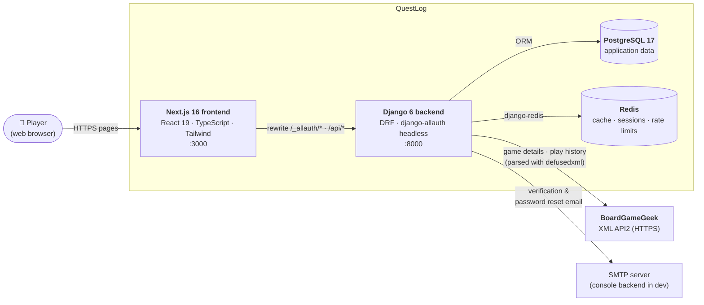

| Redis DB | Purpose |
| :---: | :--- |
| `0` | Default cache: recommendation results, DRF throttle counters, allauth rate limits, readiness probe |
| `1` | Session cache (`cached_db` engine — sessions are also persisted in Postgres) |
| `2` | Reserved for a Celery broker (no worker yet) |

---

## 2. Container Runtime (Docker Compose)

`docker compose up` starts four containers on the `questlog-net` bridge network. Health checks gate start-up order so
the backend never starts before its dependencies are ready, and the frontend never starts before the backend.

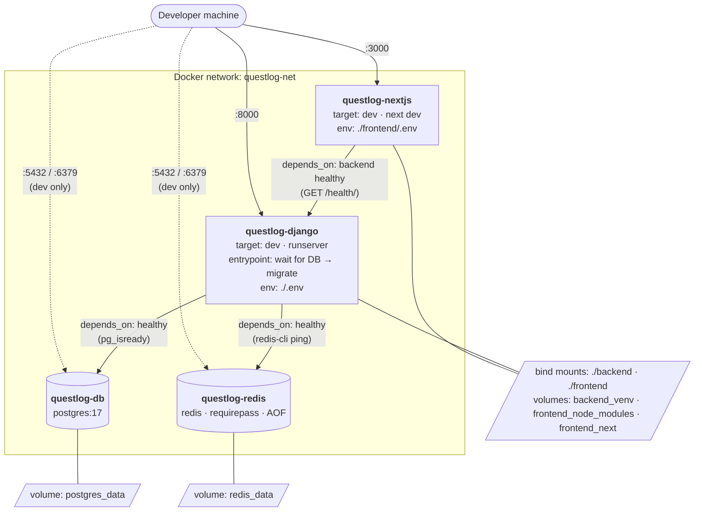

Production images use the `production` Dockerfile targets: gunicorn as the unprivileged `appuser` for Django, and the
Next.js standalone server as `nextjs`.

---

## 3. Backend Module Structure

Each Django app owns its models and endpoints. `core` holds the cross-cutting pieces (permissions, mixins, throttles,
feature flags, health probes) so the feature apps never depend on each other's views.

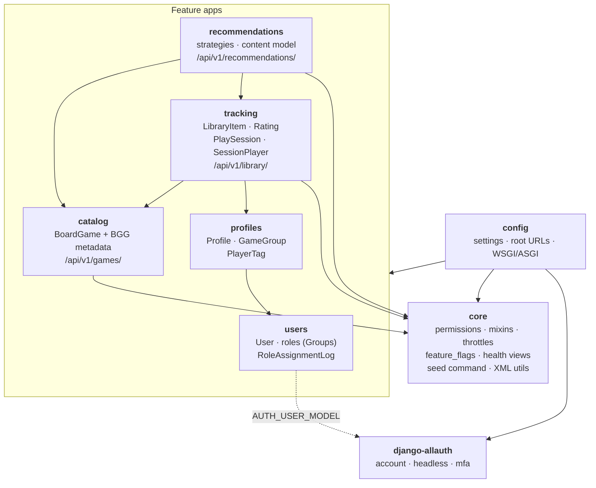

Arrows point from a module to the module it imports.

---

## 4. UML Class Diagram — Domain Models

Persistent model classes, their key fields and behavior. `BGGAttribute` is an abstract base class (no table); its six
subclasses share its fields and `__str__`.

```mermaid
classDiagram
    direction LR

    class AbstractUser {
        <<Django>>
    }
    class User {
        +UUID id
        +str email
        +datetime deleted_at
        +has_role(*names) bool
        +is_moderator() bool
        +is_admin_role() bool
    }
    class UserManager {
        +create_user(email, password) User
        +create_superuser(email, password) User
    }
    class RoleAssignmentLog {
        +str role
        +datetime assigned_at
    }
    AbstractUser <|-- User
    UserManager ..> User : creates
    User "1" --> "*" RoleAssignmentLog : role_history

    class Profile {
        +str display_name
        +str bio
        +str privacy_level
        +str bgg_username
    }
    class GameGroup {
        +str name
        +str description
    }
    class PlayerTag {
        +str tag_type
    }
    User "1" -- "0..1" Profile
    Profile "*" -- "*" Profile : friends
    User "*" -- "*" GameGroup : members
    User "1" --> "*" PlayerTag : tags_given / tags_received

    class BGGAttribute {
        <<abstract>>
        +int bgg_id
        +str name
    }
    class Category
    class Mechanic
    class Publisher
    class Designer
    class Artist
    class Family
    BGGAttribute <|-- Category
    BGGAttribute <|-- Mechanic
    BGGAttribute <|-- Publisher
    BGGAttribute <|-- Designer
    BGGAttribute <|-- Artist
    BGGAttribute <|-- Family

    class BoardGame {
        +int bgg_id
        +str primary_name
        +int year_published
        +int minimum_players
        +int maximum_players
        +int playing_time
        +Decimal average_rating
        +Decimal average_weight
        +int bgg_rank
        +create_from_xml(xml_item, backup_name)$ BoardGame
        -_handle_links(instance, xml_item)$
    }
    BoardGame "*" -- "*" BGGAttribute : categories, mechanics, publishers, designers, artists, families

    class LibraryItem {
        +str ownership
        +bool is_played
        +str house_rules
        +datetime added_at
        +datetime deleted_at
        +add_for_user(user, game)$ LibraryItem
        +soft_delete()
    }
    class LibraryItemQuerySet {
        +active() LibraryItemQuerySet
        +owned() LibraryItemQuerySet
        +wishlisted() LibraryItemQuerySet
    }
    class ActiveLibraryItemManager {
        +get_queryset() LibraryItemQuerySet
    }
    class Rating {
        +float experience
        +float mechanics
        +float replayability
        +float enjoyment
    }
    class PlaySession {
        +int bgg_play_id
        +date play_date
        +int play_time_minutes
        +int quantity
        +bool is_incomplete
        +str location
        +create_from_xml(xml_item, user, bgg_username)$ PlaySession
    }
    class SessionPlayer {
        +str guest_name
        +float score
        +bool is_winner
    }
    ActiveLibraryItemManager ..> LibraryItemQuerySet : returns active()
    LibraryItem ..> ActiveLibraryItemManager : objects
    User "1" --> "*" LibraryItem
    BoardGame "1" --> "*" LibraryItem
    User "1" --> "*" Rating
    BoardGame "1" --> "*" Rating
    BoardGame "1" --> "*" PlaySession
    GameGroup "0..1" --> "*" PlaySession
    PlaySession "1" *-- "*" SessionPlayer : players
    User "0..1" --> "*" SessionPlayer : registered player

    class RecommendationProfile {
        +bool use_personal_data
        +int preferred_player_count
        +int preferred_max_play_time
        +Decimal preferred_complexity
        +for_user(user)$ RecommendationProfile
    }
    class RecommendationFeedback {
        +str sentiment
        +str strategy
    }
    User "1" -- "0..1" RecommendationProfile
    RecommendationProfile "*" -- "*" Category : preferred_categories
    RecommendationProfile "*" -- "*" Mechanic : preferred_mechanics
    User "1" --> "*" RecommendationFeedback
    BoardGame "1" --> "*" RecommendationFeedback
```

---

## 5. UML Class Diagram — API, Permissions & Services

How the REST layer is composed. Views stay thin: they combine reusable permission classes and mixins from `core` and
delegate work to model methods or service classes.

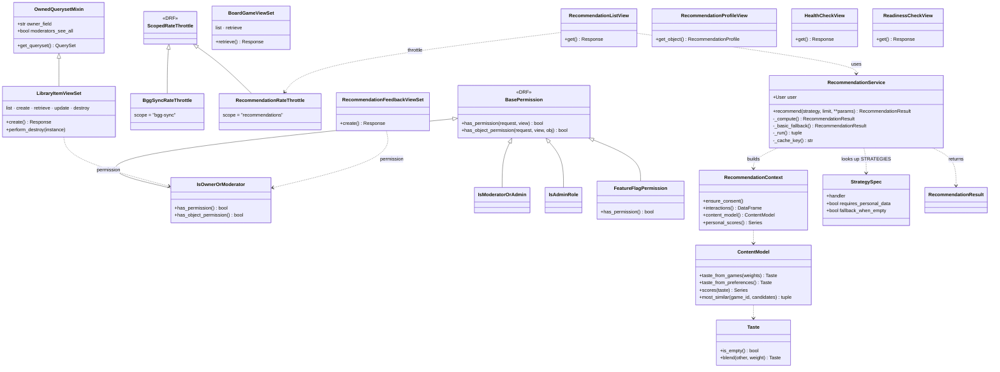

---

## 6. Entity Relationship Diagrams

Database-level view (one box per table). Django adds a join table for each many-to-many relationship, shown here as
`}o--o{`.

### 6a. Accounts, roles & social

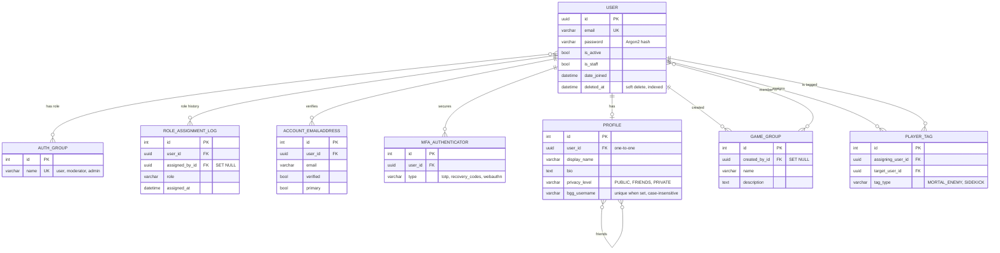

`ACCOUNT_EMAILADDRESS` and `MFA_AUTHENTICATOR` are owned by django-allauth; they are shown because the sign-up and MFA
flows depend on them.

### 6b. Catalog, tracking & recommendations

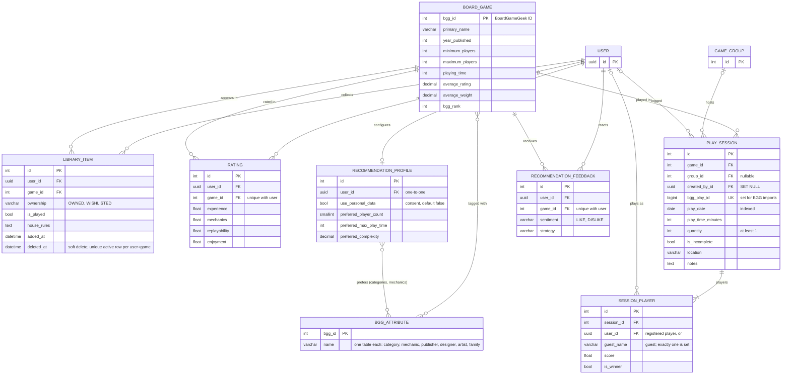

---

## 7. Request & Authorization Pipeline

Every API request passes through the same layers. Each layer can stop the request early with the status shown.

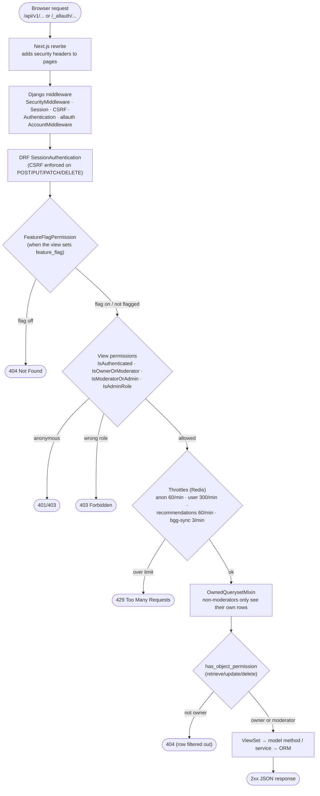

---

## 8. Sequence — Sign Up, Verify Email & Log In

Authentication uses django-allauth's headless *browser* client: an HttpOnly session cookie plus a CSRF token, never a
token stored in JavaScript.

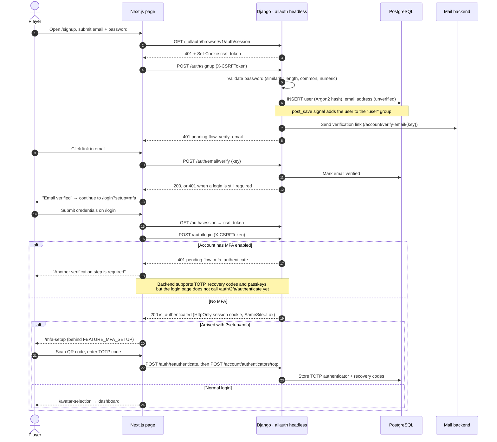

---

## 9. Sequence — Game Lookup with BGG Fallback

The catalog is a local cache of BoardGameGeek. A game is fetched from BGG the first time anyone looks it up.

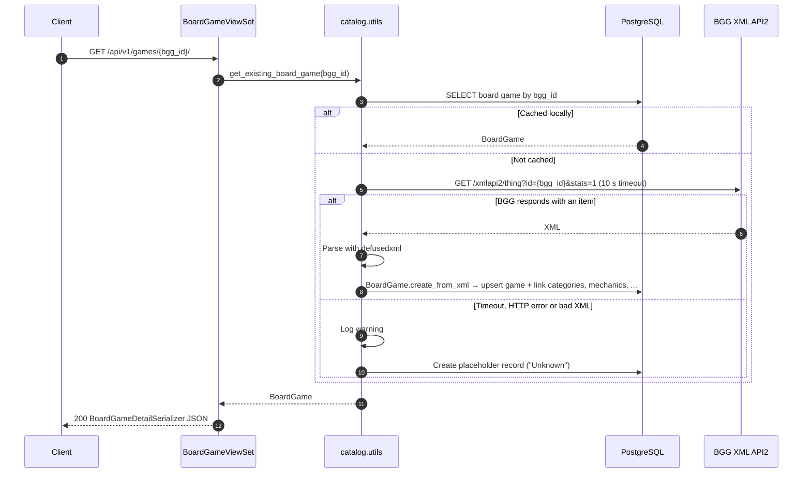

---

## 10. Sequence — Library Add & Soft Delete

Removing a game from a library sets `deleted_at` instead of deleting the row, so the data can be restored or audited.
Re-adding a removed game reuses the same row.

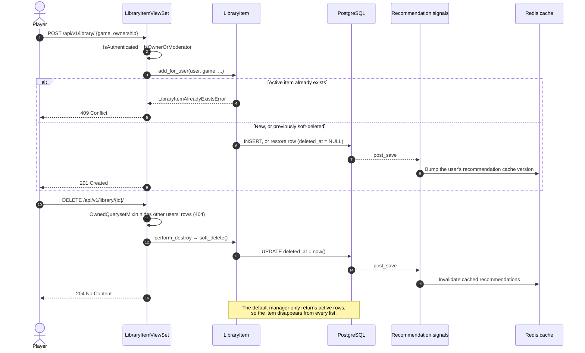

---

## 11. Activity — Recommendation Engine

`RecommendationService` answers from cache when possible, enforces consent before reading personal data, and falls back
to basic strategies that use catalog-wide data only.

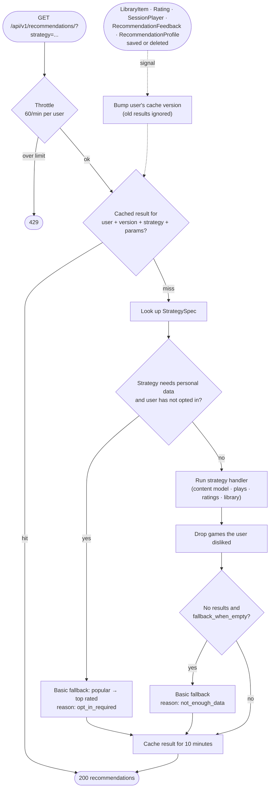

| Basic (no personal data) | Personal (requires `use_personal_data`) |
| :--- | :--- |
| `popular`, `top_rated`, `decision_chart` | `for_you`, `similar_to_recent`, `not_played_recently`, `unplayed_library`, `unplayed_wishlist`, `most_wins`, `redemption_arc` |

---

## 12. CI/CD Pipeline

GitHub Actions runs on every push to a working branch and on every pull request into `main`, `testing`, `qa` and
`production`. Jobs run in parallel; the report and summary jobs wait for the others.

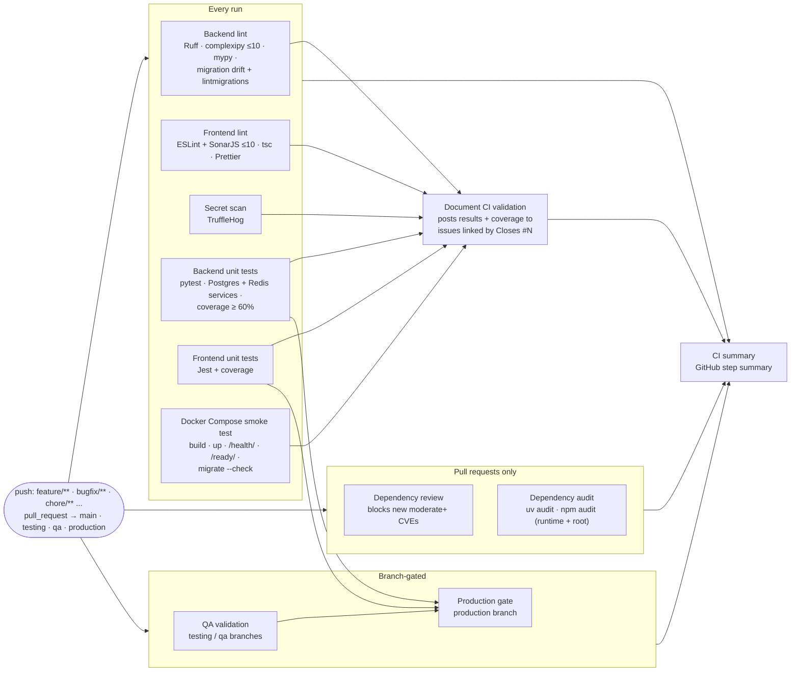

Release flow: feature branch → PR (one approval, all checks green) → `main` → annotated tag (`v0.1.0-alpha`,
`v0.5.0-alpha`, ...).
